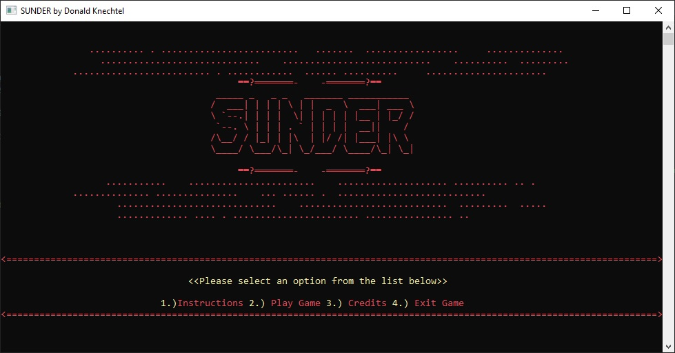
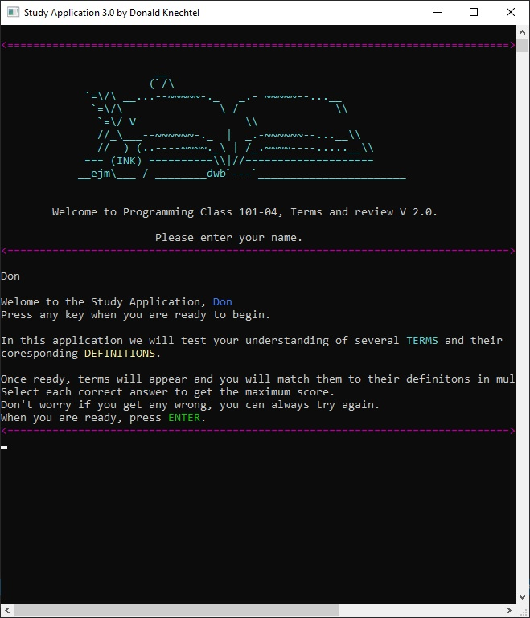
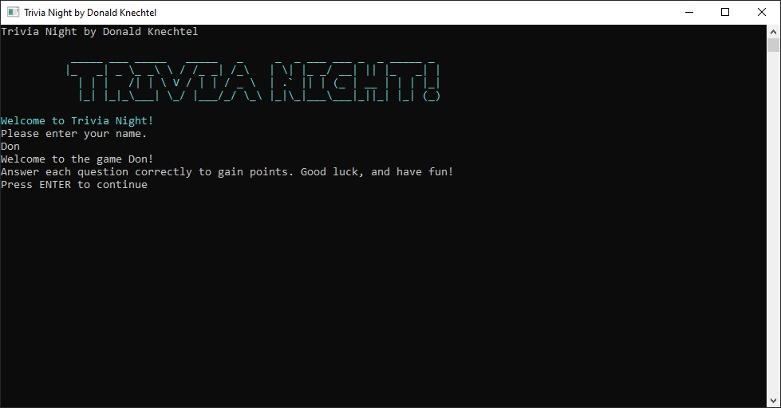

# The Knechtion's Portfolio
An example portfolio (An introduction to programming)

## Adventure Game

Utilizing knowledge from programming is fun this game demonstrates the object-oriented programming principles of inheritance, encapsulation, and polymorphism.
[Adventure Game!](https://github.com/TheKnechtion/SUNDER)

## Study Application

A [Study Application](https://github.com/TheKnechtion/StudyApp3.0) that reads in terms and definitions from an external file (or files).

## Trivia Game
 a trivia application that allows a player to guess a correct answer from several possible options. 
